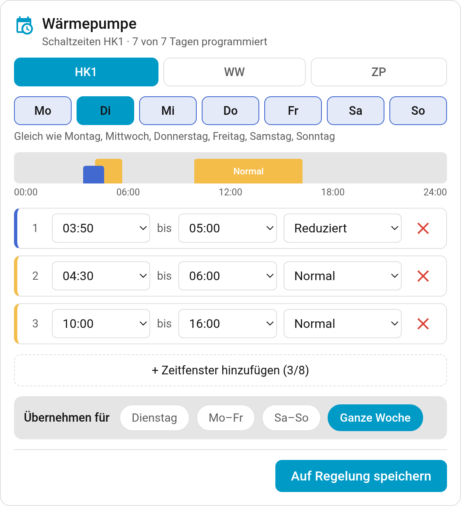
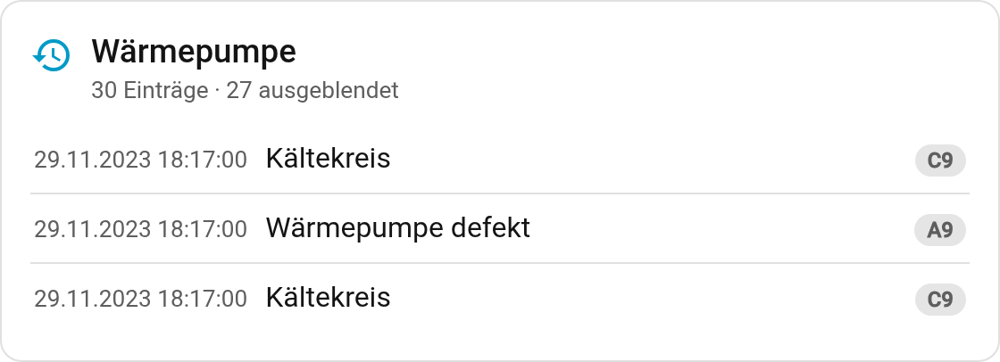

# Dashboard cards

Both cards are served by the integration and registered as a dashboard resource, so they
appear in the card picker with no manual setup.

**OptoV Schedule** edits the weekly programmes. Without configuration it shows one tab per
programme the controller has; the visual editor lets you pick a subset, name the tabs, and show
a reading and a setpoint in the header. Editing is per day, with an *apply to* choice of the
day, the working week, the weekend or the whole week, preselected from the pattern the week is
already in.



```yaml
type: custom:optov-schedule-card
entities:                             # optional, otherwise every programme
  - sensor.<schedule sensor>
  - entity: sensor.<schedule sensor>
    name: Hot water                   # your own tab label
names:                                # optional, tab labels when showing every programme
  sensor.<schedule sensor>: Hot water
actual_entity: sensor.<any>           # optional, shown in the header
demand_entity: sensor.<any>           # optional
title: <text>                         # optional
```

**OptoV Fault History** lists the controller's fault buffer with date, text and code. The
editor offers exactly the codes your controller has logged, most frequent first, so routine
entries such as the controller noting its own restarts can be hidden.



```yaml
type: custom:optov-fault-history-card
hide_codes: [FF]                 # optional
max: 30                          # optional, entries to list
height: 420                      # optional, list height in pixels before it scrolls
```

**Names in your own cards.** Home Assistant puts the device name in front of an entity's name
when a card row has no name of its own, so a row reads "Warmwasser (6006) Max. WW-Temperatur".
To show just the entity's own name, which still follows the catalog language, set the row's name
to the entity part, or choose *Composed* with only *Entity* in the row editor:

```yaml
- entity: number.<entity>
  name:
    type: entity
```
